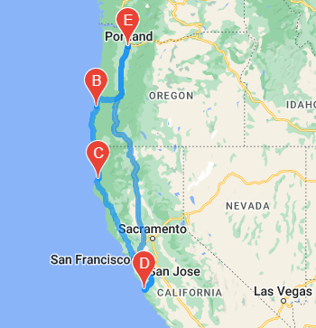

# World Weather Analysis - Travel Planning

## Overview
    
This project samples the development of a weather-conscious travel planning app. A list of over 700 cities was generated and the results of an OpenWeather API request for each city was recorded in a DataFrame. This DataFrame was then filtered by user-inputted constraints on temperature. A Google Directions API request was used to add the names of nearby hotels to this DataFrame. These results were plotted to a Google Map widget, along with similar maps for a sample itinerary for four locations in the U.S. West Coast.

## Results

| |
| - |                                                       
|  |
| 
 
 |